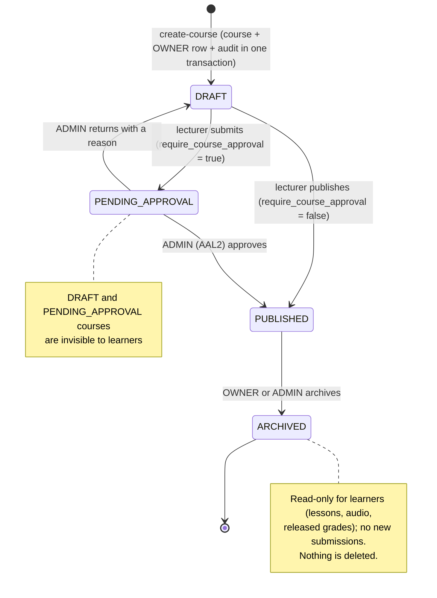
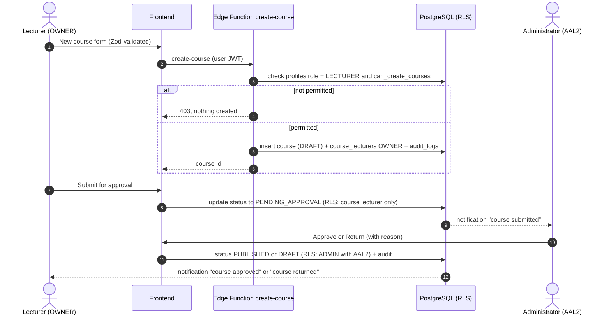

# 4a. Workflow: course lifecycle and approval

Source: D04, D06, D07, D28, D29 and BUILD_PLAN Phase 5. Every transition writes an audit record.

```mermaid
stateDiagram-v2
  [*] --> DRAFT : create-course (course + OWNER row + audit in one transaction)
  DRAFT --> PENDING_APPROVAL : lecturer submits (require_course_approval = true)
  DRAFT --> PUBLISHED : lecturer publishes (require_course_approval = false)
  PENDING_APPROVAL --> PUBLISHED : ADMIN (AAL2) approves
  PENDING_APPROVAL --> DRAFT : ADMIN returns with a reason
  PUBLISHED --> ARCHIVED : OWNER or ADMIN archives
  ARCHIVED --> [*]

  note right of PENDING_APPROVAL
    DRAFT and PENDING_APPROVAL courses
    are invisible to learners
  end note
  note right of ARCHIVED
    Read-only for learners (lessons, audio,
    released grades); no new submissions.
    Nothing is deleted.
  end note
```

```mermaid
sequenceDiagram
  autonumber
  actor Lec as Lecturer (OWNER)
  participant FE as Frontend
  participant EF as Edge Function create-course
  participant DB as PostgreSQL (RLS)
  actor Adm as Administrator (AAL2)

  Lec->>FE: New course form (Zod-validated)
  FE->>EF: create-course (user JWT)
  EF->>DB: check profiles.role = LECTURER and can_create_courses
  alt not permitted
    EF-->>FE: 403, nothing created
  else permitted
    EF->>DB: insert course (DRAFT) + course_lecturers OWNER + audit_logs
    EF-->>FE: course id
  end
  Lec->>FE: Submit for approval
  FE->>DB: update status to PENDING_APPROVAL (RLS: course lecturer only)
  DB-->>Adm: notification "course submitted"
  Adm->>FE: Approve or Return (with reason)
  FE->>DB: status PUBLISHED or DRAFT (RLS: ADMIN with AAL2) + audit
  DB-->>Lec: notification "course approved" or "course returned"
```
